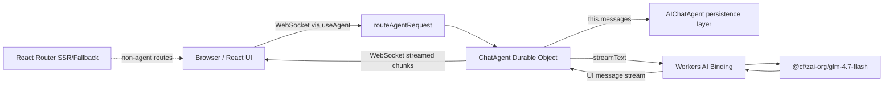
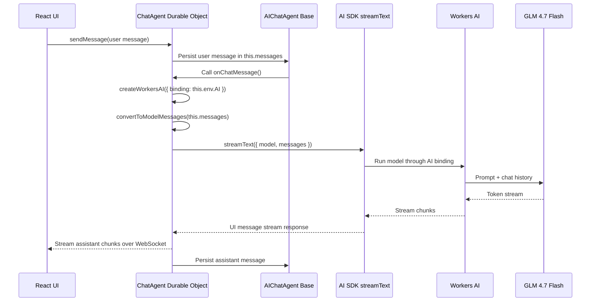
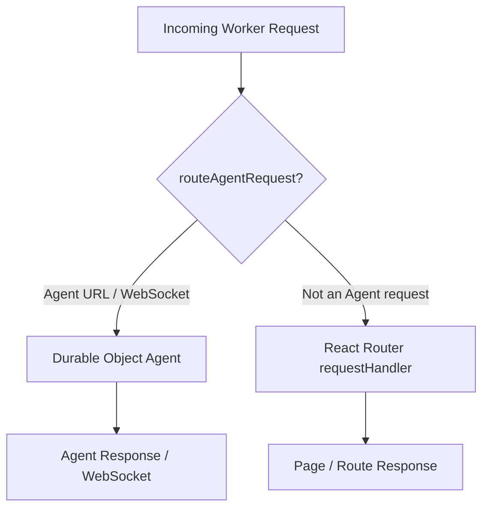
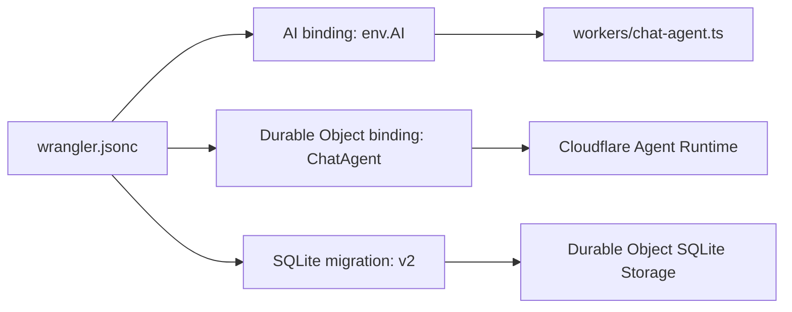
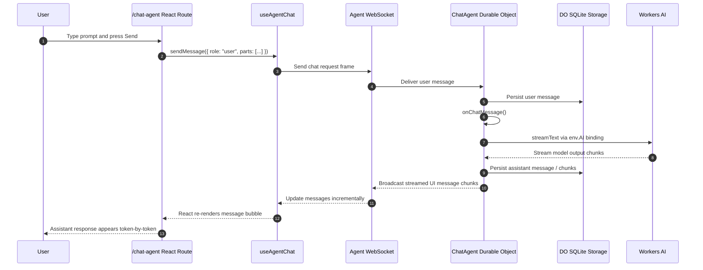
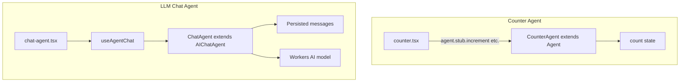
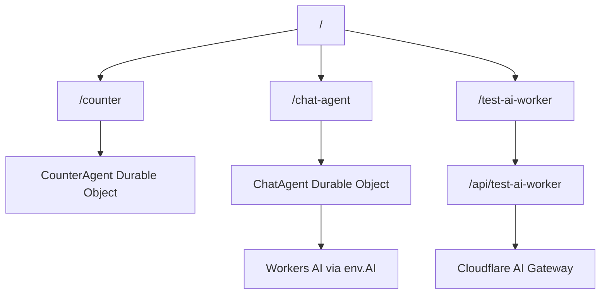
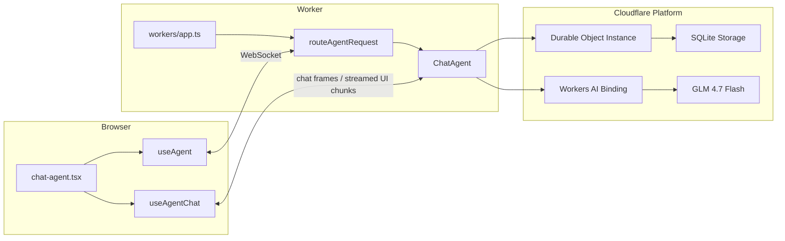

# How the LLM-backed Cloudflare Agent Works

This document explains the LLM-backed agent added to this project alongside the existing `CounterAgent`. It covers what was changed, how the server-side agent and browser UI communicate, how Workers AI is invoked, and why each configuration step is required.

---

## 1. Goal

The goal was to add a second Cloudflare Agent that is backed by an LLM, without modifying `app/routes/counter.tsx`.

The new agent uses Cloudflare's newer chat-agent stack:

- `@cloudflare/ai-chat` for chat-specific Durable Object behavior
- `workers-ai-provider` for connecting the AI SDK to Workers AI
- `ai` for model message conversion and response streaming
- `agents` / `agents/react` for Durable Object Agent routing and WebSocket client connections
- Workers AI binding `AI` for model inference inside the Worker

The resulting user-facing route is:

```txt
/chat-agent
```

---

## 2. High-level architecture



The important distinction is that this is not a normal `fetch('/api/...')` chat implementation. Instead, the React UI connects to a Cloudflare Agent Durable Object. The Durable Object owns the conversation state, persists messages, and streams model responses back to connected clients.

---

## 3. Files changed

| File | Purpose |
|------|---------|
| `workers/chat-agent.ts` | Defines the new server-side `ChatAgent` class. |
| `workers/app.ts` | Exports `ChatAgent` and lets `routeAgentRequest()` route agent traffic. |
| `wrangler.jsonc` | Adds the Workers AI binding and Durable Object binding/migration for `ChatAgent`. |
| `app/routes/chat-agent.tsx` | Adds the React chat UI using `useAgent()` and `useAgentChat()`. |
| `app/routes.ts` | Registers the `/chat-agent` route. |
| `app/routes/home.tsx` | Adds a link to the new chat demo. |
| `package.json` / `package-lock.json` | Adds required AI/chat dependencies and updates `agents`. |
| `worker-configuration.d.ts` | Regenerated Cloudflare environment types. |

---

## 4. Server-side agent

The main server-side addition is `workers/chat-agent.ts`:

```ts
import { AIChatAgent } from "@cloudflare/ai-chat";
import { convertToModelMessages, streamText } from "ai";
import { createWorkersAI } from "workers-ai-provider";

export class ChatAgent extends AIChatAgent<Env> {
  async onChatMessage() {
    const workersai = createWorkersAI({ binding: this.env.AI });

    const result = streamText({
      model: workersai("@cf/zai-org/glm-4.7-flash"),
      messages: await convertToModelMessages(this.messages),
    });

    return result.toUIMessageStreamResponse();
  }
}
```

### What this class does

`ChatAgent` extends `AIChatAgent`, which is a chat-specialized Agent base class from `@cloudflare/ai-chat`.

`AIChatAgent` provides:

- Durable Object-backed chat state
- SQLite-backed message persistence
- WebSocket delivery to connected clients
- resumable streaming support
- helper lifecycle methods such as `onChatMessage()`

The application only needs to implement `onChatMessage()`.

### What happens inside `onChatMessage()`



### Why `convertToModelMessages()` is used

The chat UI and `AIChatAgent` store messages as AI SDK `UIMessage` objects. The model provider expects model-compatible messages. This conversion step adapts persisted UI messages into the model message format required by `streamText()`.

### Why `toUIMessageStreamResponse()` is used

The `useAgentChat()` client hook expects a UI-message-compatible stream. Returning `result.toUIMessageStreamResponse()` lets the Cloudflare chat-agent runtime broadcast streamed assistant output in the shape the React hook understands.

---

## 5. Worker entrypoint integration

`workers/app.ts` now exports both agents:

```ts
export { CounterAgent } from "./agent";
export { ChatAgent } from "./chat-agent";
```

The Worker fetch handler already had this important routing step:

```ts
const agentResponse = await routeAgentRequest(request, env);
if (agentResponse) return agentResponse;
```

That line checks whether an incoming request targets an Agent. If so, the request is handled by the Agent runtime. Otherwise, the request falls through to React Router.



This is why no custom `/api/chat-agent` route was needed. The Agent framework handles the Agent transport endpoint for us.

---

## 6. Wrangler configuration

The `wrangler.jsonc` file needs two major additions for this agent.

### 6.1 Workers AI binding

```jsonc
"ai": {
  "binding": "AI"
}
```

This makes `env.AI` available inside the Worker and Durable Object. The server-side agent then passes that binding into `createWorkersAI()`:

```ts
const workersai = createWorkersAI({ binding: this.env.AI });
```

No browser API key is needed. The model call happens server-side inside Cloudflare Workers.

### 6.2 Durable Object binding

```jsonc
"durable_objects": {
  "bindings": [
    {
      "name": "CounterAgent",
      "class_name": "CounterAgent"
    },
    {
      "name": "ChatAgent",
      "class_name": "ChatAgent"
    }
  ]
}
```

This tells Cloudflare that `ChatAgent` is a Durable Object class exposed by the Worker.

### 6.3 Durable Object migration

```jsonc
"migrations": [
  {
    "tag": "v1",
    "new_sqlite_classes": ["CounterAgent"]
  },
  {
    "tag": "v2",
    "new_sqlite_classes": ["ChatAgent"]
  }
]
```

Because `AIChatAgent` uses SQLite-backed Durable Object storage for persisted chat messages, the class is added as a SQLite Durable Object class in a new migration.



---

## 7. Client-side React route

The UI lives in `app/routes/chat-agent.tsx`.

The core client connection is:

```ts
const agent = useAgent({ agent: "ChatAgent" });
const {
  messages,
  sendMessage,
  clearHistory,
  stop,
  status,
  error,
  isStreaming,
} = useAgentChat({ agent });
```

### Role of `useAgent()`

`useAgent()` creates the WebSocket connection to the named Durable Object Agent class.

Conceptually:

```txt
React component -> useAgent({ agent: "ChatAgent" }) -> WebSocket to ChatAgent instance
```

### Role of `useAgentChat()`

`useAgentChat()` layers chat-specific behavior on top of the Agent connection:

- exposes `messages`
- sends user messages with `sendMessage()`
- receives streamed assistant messages
- exposes stream state through `status` and `isStreaming`
- supports `stop()` and `clearHistory()`

### Submitting a message

The route sends messages like this:

```ts
void sendMessage({
  role: "user",
  parts: [{ type: "text", text }],
});
```

Messages are sent as AI SDK UI messages, where the actual text is stored in a `parts` array.

---

## 8. End-to-end message flow



---

## 9. Comparison with the existing Counter Agent

The project now has two different Agent styles.

| Feature | `CounterAgent` | `ChatAgent` |
|---------|----------------|-------------|
| File | `workers/agent.ts` | `workers/chat-agent.ts` |
| Base class | `Agent` | `AIChatAgent` |
| State | `{ count: number }` | persisted chat messages |
| Client hook | `useAgent()` | `useAgent()` + `useAgentChat()` |
| Transport | WebSocket/RPC callable methods | WebSocket chat protocol |
| Server methods | `increment()`, `decrement()`, `reset()` | `onChatMessage()` |
| AI model call | No | Yes, via Workers AI |
| Storage | Durable Object state | Durable Object SQLite chat persistence |



---

## 10. Dependency changes

The implementation required these packages:

```jsonc
{
  "@ai-sdk/react": "^3.0.170",
  "@cloudflare/ai-chat": "^0.5.2",
  "agents": "^0.11.6",
  "ai": "^6.0.168",
  "workers-ai-provider": "^3.1.12"
}
```

A small but important detail: `agents` was updated from `0.11.4` to `0.11.6`. The installed `@cloudflare/ai-chat` package expected newer exports from `agents/chat`, so the update was needed for production bundling to succeed.

---

## 11. Type generation and validation

After modifying `wrangler.jsonc`, Cloudflare types were regenerated with:

```bash
npm run cf-typegen
```

This updated `worker-configuration.d.ts` so TypeScript knows about:

```ts
interface Env {
  AI: Ai;
  ChatAgent: DurableObjectNamespace<import("./workers/app").ChatAgent>;
  CounterAgent: DurableObjectNamespace<import("./workers/app").CounterAgent>;
}
```

The final implementation was validated with:

```bash
npm run typecheck
npm run build
```

Both succeeded.

---

## 12. Runtime request map

The app now supports three relevant user-facing experiences:



`/chat-agent` is the new Durable Object Agent-based LLM demo. `/test-ai-worker` remains the existing API-route/SSE style demo.

---

## 13. Why this design is useful

Using `AIChatAgent` instead of a normal API route gives the app several benefits:

1. **Stateful conversations**  
   Chat history is owned by the Durable Object Agent instead of temporary browser state.

2. **Persistence**  
   Messages are stored by the Agent runtime, so refreshes/reconnections can recover state.

3. **Streaming by default**  
   The AI SDK stream is converted to a UI message stream and delivered incrementally.

4. **No client-side AI credentials**  
   The browser talks only to the Agent. Workers AI access stays server-side through `env.AI`.

5. **A clean extension point**  
   Additional tools, model settings, system prompts, or message pruning can be added inside `onChatMessage()` without changing the UI transport.

---

## 14. The complete mental model



In short:

1. The React page connects to `ChatAgent` using `useAgent()`.
2. `useAgentChat()` sends and receives chat-specific messages over that connection.
3. The Cloudflare Agent runtime routes those messages to a Durable Object instance.
4. `AIChatAgent` persists messages and invokes `onChatMessage()`.
5. `onChatMessage()` sends the conversation to Workers AI using the AI SDK.
6. The model response streams back through the Agent to the browser.

---

## 15. Future improvements

Potential next steps:

- Add a system prompt in `onChatMessage()`.
- Use `pruneMessages()` from `ai` to limit model context while keeping full persisted history.
- Add server-side tools with `tool()` from `ai`.
- Add client-side tools through `useAgentChat({ onToolCall })`.
- Route Workers AI through AI Gateway for analytics and caching.
- Add named chat sessions by passing a stable `name` to `useAgent({ agent: "ChatAgent", name: "..." })`.
